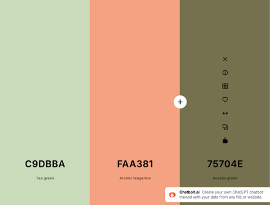
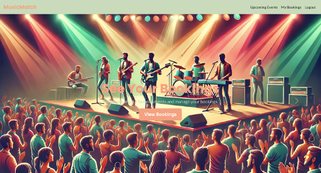
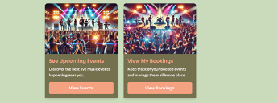
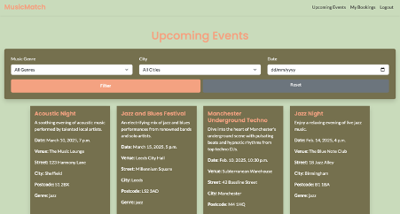
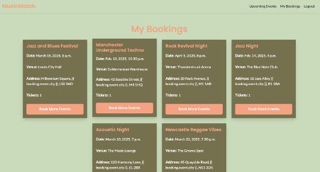

# MusicMatch App

## Table of Contents

# MusicMatch App

## Table of Contents

1. [Introduction](#introduction)
2. [Overview](#overview)
3. [UX - User Experience](#ux---user-experience)
   - [Design Inspiration](#design-inspiration)
   - [Colour Scheme](#colour-scheme)
   - [Fonts](#fonts)
4. [Project Planning](#project-planning)
   - [Strategy Plane](#strategy-plane)
   - [Site Goals](#site-goals)
   - [Agile Methodologies](#agile-methodologies)
   - [MoSCoW Prioritization](#moscow-prioritization)
   - [Sprints](#sprints)
5. [User Stories](#user-stories)
   - [Must-Have Features ✅](#must-have-features-✅)
   - [Should-Have Features ⏳](#should-have-features-⏳)
   - [Could-Have Features 🚀](#could-have-features-🚀)
6. [Scope Plane, Structural Plane, Skeleton and Surface Planes](#scope-plane-structural-plane-skeleton-and-surface-planes)
   - [Scope Plane](#scope-plane)
   - [Structural Plane](#structural-plane)
   - [Skeleton Plane](#skeleton-plane)
   - [Surface Plane](#surface-plane)
7. [Database Schema - Entity Relationship Diagram](#database-schema---entity-relationship-diagram)
   - [ERD Image](#erd-image)
   - [Overview](#overview-1)
   - [How It Works](#how-it-works)
   - [Security](#security)
     - [CSRF Tokens](#csrf-tokens)
     - [Role-Based Access Control](#role-based-access-control)
     - [Defensive Design](#defensive-design)
     - [Data Management](#data-management)
   - [Future Development](#future-development)
   - [Acknowledgments](#acknowledgments)

---

## Introduction

**MusicMatch** is a dynamic music event booking platform designed for the vibrant music scene in the UK. Built as a beginner Django project, MusicMatch focuses on enabling hosts to showcase their events while allowing users to easily book tickets. It leverages responsive design, CRUD functionality, and database management to deliver an intuitive and functional user experience.

MusicMatch was developed for educational purposes as part of my journey to learn Django and further my skills in full-stack web development using Python, Bootstrap frameworks, and AI tools such as Microsoft Co-Pilot and DALL-E.

**View the live site here:** [MusicMatch Live Site](https://music-match-483fb192c3d8.herokuapp.com/)  
**Admin access with relevant sign-in information:** [MusicMatch Admin Login](https://music-match-483fb192c3d8.herokuapp.com/admin)

---

## Overview

MusicMatch is a responsive, user-friendly booking platform catering to music enthusiasts and event organisers. The website allows users to:

- View a list of upcoming music events.
- Register and log in to book tickets for events.
- Enable hosts to create, publish, and manage events.
- Deliver a seamless mobile-first experience for easy navigation and booking.

MusicMatch seeks to address the needs of Sheffield’s vibrant music community by providing a centralised platform to connect event hosts and attendees. This MVP (Minimum Viable Product) is the foundation for further enhancements such as payment integration and advanced search features.

---

## UX - User Experience

### Design Inspiration

The design was inspired by the thriving music culture of the UK and the need for a modern, clean interface for users to interact with the platform easily. The focus was on simplicity and functionality, ensuring users could find and book events with minimal effort. Using calming fonts (Poppins for headlines and Lato for body text) enhances readability and maintains a professional, welcoming aesthetic.

### Colour Scheme

The colour palette was selected to reflect the UK’s vibrant yet grounded music scene, inspired by the 1970s with a modern-day minimalist design approach.  
Key colours include:

- **Primary:** Calm green for navigation and background (`#c9dbba`)
- **Secondary:** Bright orange accents for calls to action (`#faa381`)
- **Tertiary:** Light green and white for clarity and contrast (`#75704e`)

### Fonts

The website uses the following fonts, both imported from Google Fonts:

- **Poppins:** A clean and modern sans-serif font for headlines.
- **Lato:** A versatile sans-serif font for body text, ensuring optimal readability.

---

## Project Planning

### Strategy Plane

The core goal was to create a booking platform that bridges the gap between event hosts and attendees. The MVP ensures users can browse events, register/log in, and book tickets, while hosts can create and manage their events.

#### Site Goals

- Build a responsive website for easy access on all devices.
- Deliver an intuitive UI for a smooth user experience.
- Create scalable features to support future enhancements such as payment processing.

### Agile Methodologies

Using **GitHub Projects**, tasks were organized into user stories, development tasks, and testing tasks. Agile methodologies ensured timely delivery of the MVP, with room for additional features based on available time.

### MoSCoW Prioritization

- **Must-Have:** User registration, event listing, ticket booking, mobile responsiveness.
- **Should-Have:** Search and filter functionality, basic host dashboard, booking confirmation page.
- **Could-Have:** Simulated email confirmation, simple event search by date.
- **Won’t-Have:** Payment processing and advanced analytics in this phase.

### Sprints

Sprint planning ensured steady progress:
| Sprint | Content | Start Date | End Date |
|--------|---------------------------------|---------------|---------------|
| #1 | Project Setup & Database Design | Jan 10, 2025 | Jan 12, 2025 |
| #2 | User Authentication & Navigation | Jan 12, 2025 | Jan 15, 2025 |
| #3 | Event Creation & Booking | Jan 15, 2025 | Jan 19, 2025 |
| #4 | Frontend Design | Jan 20, 2025 | Jan 23, 2025 |
| #5 | Testing & Deployment | Jan 23, 2025 | Jan 25, 2025 |

---

## User Stories

### Must-Have Features ✅

1. **View List of Upcoming Events**

   - **User Story:** As a site user, I can view a list of upcoming music events in Sheffield, so that I can decide which event to attend.
   - **Acceptance Criteria:**
     - Given multiple events exist in the database, then they are displayed on the homepage.
     - When a user visits the homepage, then they see event titles, dates, and venues.

2. **User Registration and Login**

   - **User Story:** As a site user, I can register and log in to the site, so that I can book tickets for events.
   - **Acceptance Criteria:**
     - Given a registration form, then users can create an account with a username, email, and password.
     - When a user logs in, then they can access event booking features.

3. **Host Event Creation**

   - **User Story:** As an event host, I can create and publish new music events, so that users can discover and book my events.
   - **Acceptance Criteria:**
     - Given that a host is logged in, then they can access an event creation form.
     - When the host submits event details (title, description, date, venue), then the event is displayed on the homepage.

4. **Book a Ticket for an Event (Without Payment Integration)**

   - **User Story:** As a site user, I can book a ticket for an event, so that I can attend it.
   - **Acceptance Criteria:**
     - Given that the user is logged in, then they can click a “Book Now” button on event pages.
     - When the user confirms the booking, then a success message is displayed and the booking is saved.

5. **Mobile-Responsive Design**
   - **User Story:** As a site user, I can access the website on my mobile device, so that I can browse and book events easily.
   - **Acceptance Criteria:**
     - Given the user is on a mobile device, then the website layout adjusts to fit the screen.
     - When browsing events, then the interface remains easy to navigate.

### Should-Have Features ⏳

6. **Search and Filter Events**
7. **Basic Host Dashboard (View Events Only)**
8. **Booking Confirmation Page**

### Could-Have Features 🚀

9. **Simulated Email Confirmation**
10. **Simple Event Search by Date**

---

## Scope Plane, Structural Plane, Skeleton and Surface Planes

| Feature               | Visitors | Registered Users |
| --------------------- | -------- | ---------------- |
| View Events           | Yes      | Yes              |
| Book Tickets          | No       | Yes              |
| Host Dashboard        | No       | Yes (Hosts Only) |
| Mobile Responsiveness | Yes      | Yes              |
| CRUD Functionality    | No       | Yes              |

### Scope Plane

The scope of **MusicMatch** focuses on addressing key needs for both event organizers and attendees. The primary aim is to create a user-friendly platform where:

- Users can explore, register, and book tickets for events with ease.
- Event hosts can create, manage, and promote events effectively.

#### Essential Features:

- User registration and authentication.
- Event creation by hosts.
- Event browsing and ticket booking.
- Responsive design for all devices.

- Attendee/Customer Features:
  
  
  
  

- Event Hoder Features:
  
  
  
  

#### Future Scope:

- Integration of payment gateways.
- Advanced search options, including artist and genre-based filters.
- Email notifications and reminders for bookings.
- Enhanced host dashboards with analytics and ticket management.

---

### Structural Plane

The structural design of **MusicMatch** ensures logical organization and easy navigation. Core elements were developed to cater to both functional requirements and user interaction flow.

#### Navigation Design:

- A clear, top navigation bar provides direct access to key sections: Home, Events, Login, and Host Dashboard.
- Conditional links based on user roles (attendees vs. hosts).

#### Page Layout:

- **Events Listing Page:** Features a card-based design, with event titles, dates, and venues clearly displayed.
- **Host Dashboard:** Displays a list of hosted events with options to edit or delete events.
- **Mobile Responsiveness:** Bootstrap grid classes and custom CSS ensure seamless transitions between devices.

#### Accessibility:

- Added ARIA roles and semantic HTML tags for screen readers.
- Tooltips for icons and form fields provide extra guidance for users.

---

### Skeleton Plane

The skeleton phase involved creating wireframes to map out user interactions and content placements. These were designed to prioritize intuitive navigation and visually balanced layouts.

#### Wireframe Highlights:

- **Homepage:**
  - Hero section with a welcome message and CTA buttons for exploring events or signing up.
  - Upcoming events preview with a "View All Events" link.
- **Event Details Page:**
  - Displays detailed information about the event, including date, time, and venue.
  - A prominent "Book Now" button for ticket reservation.
- **Host Dashboard:**
  - A list of events created by the host, with action buttons for editing or deleting events.

#### Design Tools Used:

- Wireframes were created using Figma to ensure precision and clarity.
- Focus on a grid-based layout to ensure modularity.

---

### Surface Plane

The surface plane of **MusicMatch** focuses on the aesthetics and visual appeal while maintaining usability.

#### Colour Scheme:

- **Primary:** `#faa381` (light orange) for action buttons and highlights.
- **Secondary:** `#c9dbba` (muted green) for backgrounds and soft accents.
- **Accent:** `#75704e` (dark olive) for text and subtle elements.

#### Typography:

- **Poppins:** Used for headings to create a modern and approachable look.
- **Lato:** Used for body text to ensure readability and clean presentation.

#### UI Enhancements:

- Buttons with hover animations to provide feedback on interactions.
- Rounded corners and shadows on cards for a polished appearance.
- Icons sourced from FontAwesome for intuitive and consistent visual cues.

#### Responsive Design:

- Media queries ensure that elements scale and adjust seamlessly across devices.
- Forms and tables are optimized for smaller screens without sacrificing functionality.

---

Conclusion

The integration of the **Scope**, **Structural**, **Skeleton**, and **Surface** planes ensures that **MusicMatch** delivers a cohesive and delightful experience for all users. These foundational design principles provide a scalable framework to enhance the platform in future iterations.

## **Database Schema - Entity Relationship Diagram**

### **ERD Image**

  
_(Replace `#` with the link to your ERD image if hosted, or upload it here.)_

---

### **Overview**

The **Entity Relationship Diagram (ERD)** for MusicMatch demonstrates the relationships between the various components of the application and how they connect to the underlying PostgreSQL database. It outlines how users, events, bookings, and profiles are interlinked.

MusicMatch leverages Django’s built-in `User` model for user authentication and authorization. When a user registers, a `user_id` is created, which acts as a unique identifier linking them to other key features such as creating and managing events, making bookings, and editing their profile. This ensures seamless data connectivity across the platform.

---

### **How It Works**

1. **User Authentication**:

   - Django's `User` model handles registration and login functionalities.
   - A `Profile` model is linked to the `User` model using a one-to-one relationship. This allows for role-based differentiation (e.g., `customer` or `event_holder`).

2. **Events and Bookings**:

   - Users with the `event_holder` role can create and manage `Event` entries.
   - Users (both `customers` and `event_holders`) can book tickets for events. The `Booking` model links users to specific events, with attributes like ticket count and booking time.

3. **Django Admin Panel**:
   - Administrators can view and manage all data, including events, profiles, and bookings, through Django’s Admin dashboard.
   - Data integrity is ensured with `on_delete=models.CASCADE`, meaning when a user is deleted, all their related data (e.g., events, bookings) is automatically removed.

---

### **Security**

A range of measures were implemented to protect user data and ensure the platform operates securely:

#### **1. CSRF Tokens**

- Every form submission includes CSRF (Cross-Site Request Forgery) tokens to validate requests and protect against unauthorized actions.

#### **2. Role-Based Access Control**

- The platform uses role-based logic to control user access:
  - Customers can book events but cannot create or edit them.
  - Event holders can create, update, and delete their own events.
  - Admins have full access to all content and user data.

#### **3. Defensive Design**

- **Input Validation**:
  - Forms validate user input to ensure data integrity and avoid errors.
- **Error Handling**:
  - User-friendly error messages and fallback pages guide users when issues arise.
- **Restricted Access**:
  - Unauthenticated users are redirected to the login page when attempting to access restricted sections like event creation or bookings.

#### **4. Data Management**

- All user-generated content is tied to their `user_id`. Deletion of a user cascades and removes related data (e.g., bookings, events) to prevent orphaned records.
- Users can update or delete their profile information, but account deletion is currently unavailable. This will be included in a future release.

---

### **Future Development**

For future versions of MusicMatch, the following features will enhance its database schema and security:

1. **Payment Integration**:
   - Adding support for secure payment gateways (e.g., Stripe or PayPal) to process event ticket purchases.
2. **Feedback System**:
   - Users will be able to leave reviews for events and organizers.
3. **Enhanced User Authentication**:
   - Integration with social login options (e.g., Google or Facebook) via Django AllAuth.
4. **Advanced Search Filters**:
   - Adding search options for events based on `music_genre`, `venue`, or `date`.

---

### **Acknowledgments**

The models for MusicMatch were developed using foundational Django concepts, with inspiration drawn from various learning resources:

- The **Code Institute** blog walkthrough provided a strong base for profile and booking models.
- Practical experimentation with Django’s `User` model and the `ForeignKey` and `OneToOneField` relationships allowed for more complex interactions between entities.
